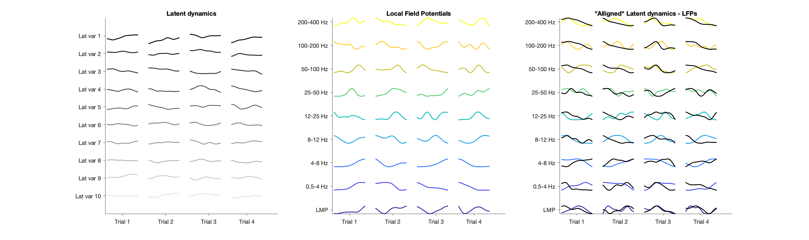
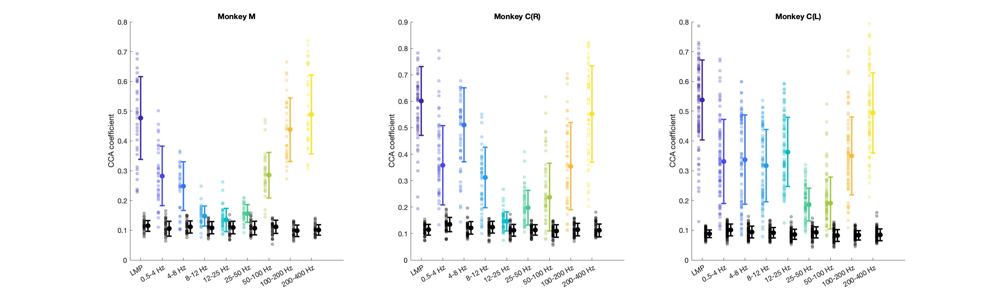
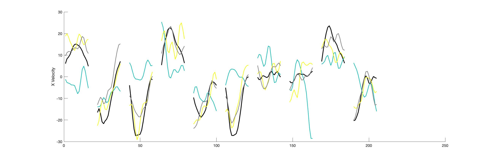
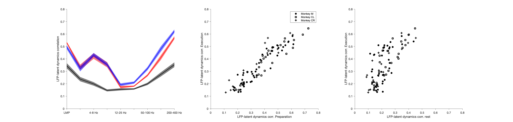
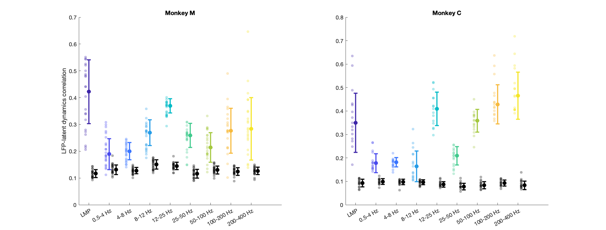
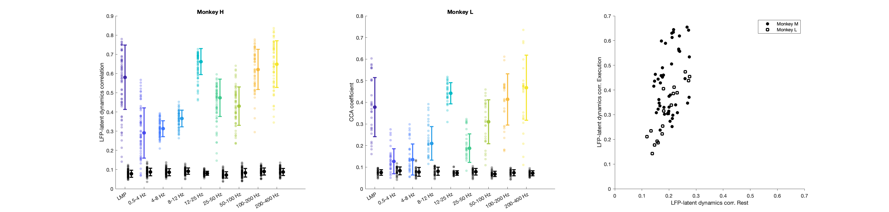

# Results
The results include the figures in .fig and .png format.

## Figures
### Figure 3
Similarity between primary motor cortex (M1) latent dynamics and each local field potential (LFP) band during movement execution

Left: Example M1 latent dynamics during four reaches to different targets (direction indicated by the arrows above each column); figure shows top
10 dimensions of the latent dynamics. 
Middle: Example LFP power in each of the nine bands we study during the same three trials. 
Right: Canonical correlation analysis (CCA) ‘alignment’ finds strong similarities between certain LFP bands and the latent dynamics. r, correlation coefficient. From one session from Monkey $C_L$.

Correlation between each LFP band and the latent dynamics (coloured markers) during one representative session from each M1 monkey. Black markers show the control correlation values obtained after generating surrogate neural activity using tensor maximum entropy (TME); note that at low and high LFP frequencies, the actual correlations are much larger than the surrogate correlations. Error bars, median ± s.d. 

### Figure 4
Decoding movement kinematics from primary motor cortex (M1) local field potentials (LFPs)

Example x-axis velocity predictions during nine randomly selected trials from one session from Monkey $C_L$. Note the clear difference in predictive accuracy between the example LFP bands (values for each input signal during the example trials shown are indicated in the legend). Scale bars: horizontal, 300 $ms$; vertical, 10 $cm·s^{–1}$.

### Figure 5
The primary motor cortex (M1) local field potential (LFP)-latent dynamics correlation profile is preserved between movement planning and execution

(Left) LFP-latent dynamics correlation profiles across all sessions from all three M1 monkeys. Line and shaded areas, mean ± s.e.m. across all session medians. Each epoch is shown in a different colour. (Middle) Comparison between the LFP-latent dynamics correlations during movement preparation and execution. Each marker shows one frequency band for one session; each monkey is represented using a different marker (legend). Note the very strong similarity between epochs. (Right) Comparison between the LFP-latent dynamics correlations during movement execution and the inter-trial period. Data formatted as in B. Note the marked decrease in correlations during the inter-trial period.

### Figure 6
Similarity between dorsal premotor cortex (PMd) latent dynamics and each local field potential (LFP) band during movement preparation.

Correlation between each LFP band and the latent dynamics (coloured markers) during one representative session from each PMd monkey. Black markers show the control correlation values obtained after generating surrogate neural activity using tensor maximum entropy (TME). Error bars, median ± s.d.

### Figure 7
Similarity between area 2 latent dynamics and each local field potential (LFP) band during somatosensory feedback processing

(Left & Middle) Correlation between each LFP band and the latent dynamics (coloured markers) during one representative session from each area 2 monkey;
for Monkeys H and L, respectively. Note the clear frequency-dependent relationship between LFP and latent dynamics. Error bars, median ± s.d. (Right) Comparison between the LFP-latent dynamics correlations during movement execution and the inter-trial period;